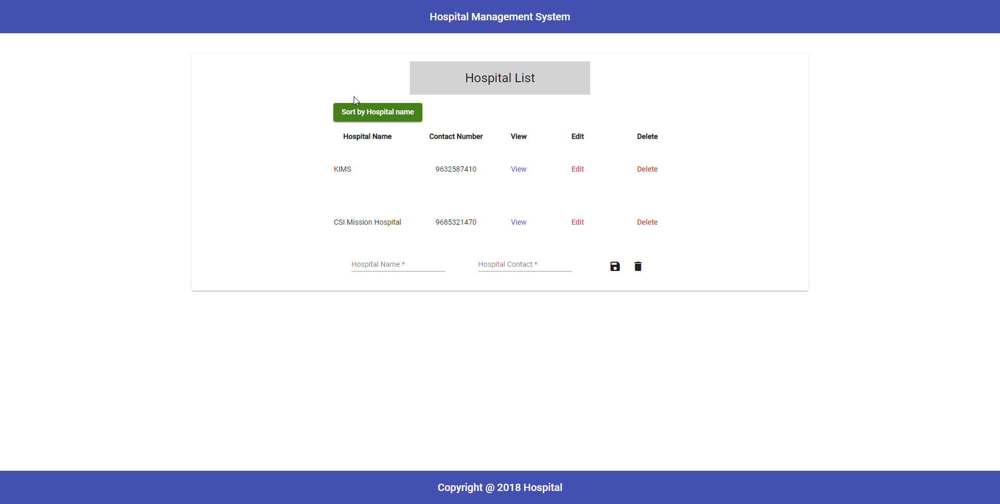

# HospitalManagementSystem

Problem statement of this task is attached in the Repo namely Angular Assessment.pdf. Also, attaching a gif of working application 

# Structure

All the backend related Node/Express code is kept inside backend folder. It contains all the rest APIs and the server which runs on port 3000 http://localhost:3000
Root folder has front end angular code.

## Next steps

1. Integrate database and use mongoose to make it full fleged application.
2. Use Authentication and authorization for security.
3. Use pagination to handle huge data. 

## How to start
1. Clone this repo
2. Install all packages using command 'npm install' in cmd or terminal where package.json file is present outside of backend directory.
3. Open terminal/cmd and run command 'ng serve' outside of backend directory to compile and load front end. This will run on http://localhost:4200 (development server). This will be the address you need to open to see the live application.
4. Open another terminal/cmd and run command 'npm run start-server' outside of backend directory to execute backend API system.

## Development server

Run `ng serve` for a dev server. Navigate to `http://localhost:4200/`. The app will automatically reload if you change any of the source files.

## Code scaffolding

Run `ng generate component component-name` to generate a new component. You can also use `ng generate directive|pipe|service|class|guard|interface|enum|module`.

## Build

Run `ng build` to build the project. The build artifacts will be stored in the `dist/` directory. Use the `--prod` flag for a production build.

## Running unit tests

Run `ng test` to execute the unit tests via [Karma](https://karma-runner.github.io).

## Running end-to-end tests

Run `ng e2e` to execute the end-to-end tests via [Protractor](http://www.protractortest.org/).

## Further help

To get more help on the Angular CLI use `ng help` or go check out the [Angular CLI README](https://github.com/angular/angular-cli/blob/master/README.md).
"# hospital-management-system-Adobe" 
